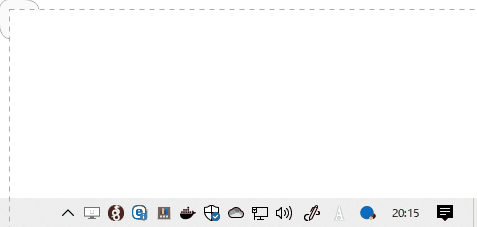

# Toast Notification for Microsoft ToDo



## How to set up

### 1. clone this repository

```console
$ git clone https://gitlab.com/ino-playground/ms-todo-daily-report.git
# If possible, clone it on your system drive (ex. C:)
```

### 2. Confirm that you receive the Notification

Run this code on CommandPrompt (`cmd.exe`).

```cmd
C:\Users\inox-ee> powershell.exe -ExecutionPolicy RemoteSigned -Command path\to\your\repository\main.ps1
```

### 3. create a task schedule (`Taskschd.msc`)

Create Basic Task Wizard.
Set **Action** config as follows.

    Program/script: C:\Windows\System32\WindowsPowerShell\v1.0\powershell.exe (This depends on your env)
    Add arguments: -ExecutionPolicy RemoteSigned -Command path\to\your\repository\main.ps1
    Start in: path\to\your\repository

## Trouble Shooting

### Security Policy

Default Execution Policy of PowerShell is **Restricted**.

### Garbled characters

The `main.ps1` file must be saved in `Shift-JIS`.

### Invalid AppID (at `main.ps1` L63)

This `$app_id` is **Application User Model ID**.
Read [this page](https://docs.microsoft.com/en-us/windows/configuration/find-the-application-user-model-id-of-an-installed-app) and rewrite your AUMID.
